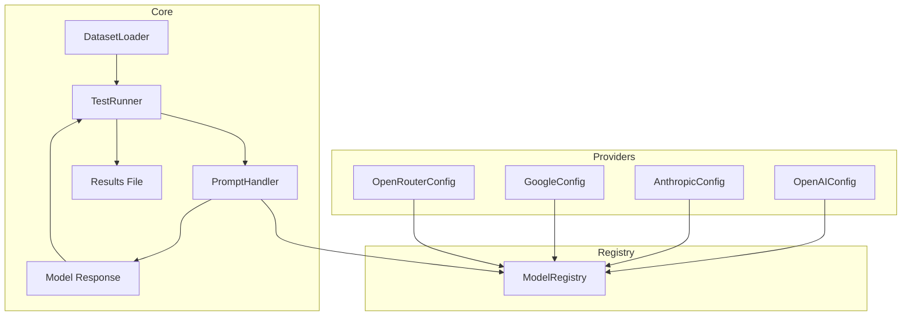

# LLMTest

LLMTest is a lightweight framework for running reproducible tests on large language models (LLMs).  
It provides utilities for loading datasets, building prompts, running models via a unified handler, and saving results for evaluation.

## Getting Started

## Setup the virtual environment

Using **pipenv** is recommended for reproducible environments.
First create venv in project directory. 
Next run command from terminal.

```bash
pip install pipenv
```
Initalize pipenv

```bash
pipenv --python 3.13
```
Activate the environment

```bash
pipenv shell
```
Install dependencies

```bash
pipenv install
```

## API Keys

LLMTest uses environment variables for provider keys.
Set them before running tests.

Keys are automatically loaded via **ProviderKeys**.

A *.env template* is provided in the repository to help you set up keys quickly.
You can copy it to .env and fill in your values:
```bash
cp .env.template .env
```

You can also use:
```bash
export OPENAI_API_KEY="your-key"
export ANTHROPIC_API_KEY="your-key"
```

### Naming Convention
- Keys must follow the *_API_KEY naming convention (e.g., OPENAI_API_KEY, ANTHROPIC_API_KEY).
- If you don’t follow this convention, the key will not be detected or added.

### Important
- The content of the key is not validated by LLMTest.

## Model Registry & Providers

LLMTest uses a **global ModelRegistry** to manage available providers and models.  
This ensures a consistent interface for looking up models and running tests.

###  Built-in Providers
Currently, the framework ships with support for:
- **OpenAI**  
  - Popular models (e.g., `gpt-4o`, `gpt-4.1`).
- **Anthropic** 
  - Popular models (e.g., `claude-opus-4`, `claude-sonnet-4-5`).
- **Google**  
  - Popular models (e.g., `gemini-2.5-pro`, `gemini-2.0-flash`).
- **OpenRouter**  
  - Popular models (e.g., `grok-4-fast`, `deepseek-v3.2`).

These providers are available out-of-the-box once you set the appropriate API keys.

To make them available in the registry, you need to call:

```python
from lib.registry import register_all_models
register_all_models()
```

- You can add custom providers based on **BaseProviderConfig** class and them into the registry.
- Adding and removing models from an existing provider is possible.

## Test Runner

The **TestRunner** is the main entry point for running model tests.  
You only need to initialize it with your own configuration and run `run_model()` function.  
It also supports concurrency via `asyncio`, so multiple requests can be executed in parallel.


**TestRunner** uses a **prompt_builder** function as one of the parameters to transform each dataset row into the prompt (or prompt object) sent to the chosen model.  
You can add custom builder functions in order to use a prompt tailored to your needs.

A simple **template_prompt** function is provided as a starting point for writing custom builders.  
A custom prompt_builder follows a simple contract:
- It receives a dataset row as its main input.
- It can also accept extra parameters (for example, a column name) to decide how that row should be formatted.
- It returns either:
  - a **string** plain prompt text,
  - a **sequence** containing structured prompt content,
  - or **None** (rare, only if you want to skip a row).

This design lets you adapt the builder to different tasks: you might pull text from a single column, combine multiple fields, add fixed instructions, or return richer structures for classification and evaluation.  
The template provided in the repo shows the expected shape, and you can extend it with parameters that make sense for your use case.

### Input vs Output Formats

- **Input datasets** can be loaded from CSV, JSON, JSONL, or Parquet. Hugging Face datasets are also supported via `hf://` links with an optional `split` parameter.
- **Output results** are standardized to JSONL (or optionally CSV) to ensure consistency across evaluation pipelines.
  - JSONL is chosen as the default because it is line-oriented, easy to parse, and works well with record-level evaluation.

## Dependencies & Design

This project uses [Pydantic](https://ai.pydantic.dev/) both for data validation, provider configuration, and prompt execution via `pydantic-ai.Agent`.

## Evaluation
LLMTest includes several built-in evaluation scripts for common tasks:
- evaluate_accuracy.py - match for QA tasks, especially multiple choice tests
- evaluate_bertscore.py - semantic similarity using BERTScore
- evaluate_rouge.py - ROUGE metrics for summarization
- evaluate_classification.py - label-based comparison, computes accuracy, macro precision/recall/F1, per-class stats, optionally generates a confusion matrix heatmap for visual inspection
- evaluate_llm_judge_scale_01.py - LLM-based scoring on a 0–1 scale, works with or without reference
- evaluate_llm_judge_prompt_only.py - prompt-only LLM-based judging

These evaluators are designed to work directly with result JSONL files produced by TestRunner.
Just pass the output file and specify the relevant columns (e.g. reference, model_answer), no extra preprocessing needed.

## Benchmark Runner 
The **BenchmarkRunner** allows running the same test across multiple models and evaluating their outputs in a unified way.

It builds on top of **TestRunner** and:
- executes one TestRunner per model,
- ensures all models use the same dataset selection and prompt builder,
- aggregates all model outputs into a single benchmark dataset,
- applies one or more evaluation functions to each model’s results.

### Outputs
A benchmark run produces two artifacts:
- A merged dataset containing outputs from all tested models, enriched with model and benchmark metadata.
- A summary of evaluation results for each model and evaluation method.

### Evaluations
Evaluations are provided as callables operating on result files produced by TestRunner.
Both synchronous metrics (e.g. ROUGE, BERTScore) and asynchronous LLM-based judges are supported.

The evaluation name is user-defined and used only for labeling results.